# AppModules Dependency Map

> Mermaid graph showing Engines and Components and their main call paths, grouped by phase (C through D15).

```mermaid
graph TD
    subgraph "Phase C — Dynamic Modules"
        C_MS[Components.MetricStrip]
        C_LR[Components.LifecycleRail]
        C_CST[Components.ContractSummaryTable]
        C_PIT[Components.PreflightIssueTable]
    end

    subgraph "Phase D1 — Grid"
        D1_GS[Engines.GridState]
        D1_GH[Components.GridHeader]
        D1_GT[Components.GridTable]
        D1_GH -->|getColumnLetter| D1_GS
        D1_GT -->|renderBatch| renderGridBatch
    end

    subgraph "Phase D2 — Record Inspector"
        D2_RIS[Engines.RecordInspectorState]
        D2_RIH[Components.RecordInspectorHeader]
        D2_RIFL[Components.RecordInspectorFieldList]
        D2_RIPR[Components.RecordInspectorPatchRail]
        D2_RIH -->|getRef| D2_RIS
        D2_RIFL -->|render| renderSrrFields
        D2_RIPR -->|expand/collapse| _srrExpandPatchPanel
    end

    subgraph "Phase D3 — PDF Viewer"
        D3_PVS[Engines.PdfViewerState]
        D3_PVT[Components.PdfViewerToolbar]
        D3_PVF[Components.PdfViewerFrame]
        D3_PVT -->|prevPage/nextPage| srrPrevPage/srrNextPage
        D3_PVF -->|loadForRecord| srrLoadPdfForRecord
        D3_PVF -->|jumpToAnchor| srrJumpToAnchor
    end

    subgraph "Phase D4 — Admin Panel"
        D4_ATS[Engines.AdminTabState]
        D4_ATN[Components.AdminTabsNav]
        D4_ATG[Components.AdminTabGovernance]
        D4_ATSS[Components.AdminTabSchemaStandards]
        D4_ATPO[Components.AdminTabPatchOps]
        D4_ATPA[Components.AdminTabPeopleAccess]
        D4_ATQR[Components.AdminTabQARunner]
        D4_ATRC[Components.AdminTabRuntimeConfig]
        D4_ATN -->|resolveAlias| D4_ATS
        D4_ATN -->|switchTab| switchAdminTab
        D4_ATG -->|onActivate| BatchMerge
    end

    subgraph "Phase D5 — Audit Timeline"
        D5_ATS[Engines.AuditTimelineState]
        D5_ATP[Components.AuditTimelinePanel]
        D5_ATF[Components.AuditTimelineFilters]
        D5_ATP -->|updateBadge| D5_ATS
        D5_ATF -->|resetAll| D5_ATP
    end

    subgraph "Phase D6 — DataSource/Import"
        D6_IS[Engines.ImportState]
        D6_WSS[Engines.WorkbookSessionStore]
        D6_DSP[Components.DataSourcePanel]
        D6_DSP -->|handleExcelUpload| handleExcelUpload
        D6_DSP -->|open| openDataSourcePanel
    end

    subgraph "Phase D7 — System Pass"
        D7_SPS[Engines.SystemPassState]
        D7_SPP[Components.SystemPassPanel]
        D7_SPA[Components.SystemPassActions]
        D7_SPS -->|run/accept/reject| SystemPass
        D7_SPP -->|open| rerunSystemPass
        D7_SPA -->|acceptProposal| acceptSystemPassProposal
    end

    subgraph "Phase D8 — Contract Health"
        D8_CHS[Engines.ContractHealthState]
        D8_CHP[Components.ContractHealthPanel]
        D8_CHB[Components.ContractHealthBadges]
        D8_CHS -->|computeAll/computeScore| ContractHealthScore
        D8_CHP -->|renderHealthCell| ContractHealthScore
        D8_CHB -->|renderInlineBadge| ContractHealthScore._scores
    end

    subgraph "Phase D9 — Data Quality"
        D9_DQS[Engines.DataQualityState]
        D9_DQM[Components.DataQualityModal]
        D9_DQA[Components.DataQualityActions]
        D9_DQS -->|run/rerun| _dqCheckRun/_dqCheckRerun
        D9_DQM -->|show| _dqCheckShowModal
        D9_DQA -->|acctDismiss/Merge| _dqAcctDismiss/_dqAcctMerge
    end

    subgraph "Phase D10 — Batch Merge"
        D10_BMS[Engines.BatchMergeState]
        D10_BMP[Components.BatchMergePanel]
        D10_BMA[Components.BatchMergeActions]
        D10_BMS -->|getMergedBatches| BatchMerge._mergedBatches
        D10_BMP -->|renderMergedBatchPanel| BatchMerge.renderMergedBatchPanel
        D10_BMA -->|executeMerge| BatchMerge.executeMerge
    end

    subgraph "Phase D11 — Grid Context Menu"
        D11_GCS[Engines.GridContextState]
        D11_GCM[Components.GridContextMenu]
        D11_GCA[Components.GridContextActions]
        D11_GCM -->|open/close| _gridCtxOpen/_gridCtxClose
        D11_GCA -->|dispatch| _gridCtxAction
        D11_GCA -->|getActionState| D11_GCS
    end

    subgraph "Phase D12 — Patch Studio"
        D12_PSS[Engines.PatchStudioState]
        D12_PSP[Components.PatchStudioPanel]
        D12_PSE[Components.PatchStudioEvidence]
        D12_PSP -->|open| _srrExpandPatchPanel
        D12_PSP -->|submit| srrSubmitPatchRequest
        D12_PSP -->|openDrawer| _gridOpenPatchDrawer
        D12_PSE -->|checkEvidenceGate| srrCheckEvidenceGate
        D12_PSS -->|validateGates| validateSubmissionGates
    end

    subgraph "Phase D13 — Contract Index"
        D13_CIS[Engines.ContractIndexState]
        D13_CIQ[Components.ContractIndexQueries]
        D13_CIR[Components.ContractIndexRollups]
        D13_CIS -->|build| ContractIndex.build
        D13_CIS -->|reset| ContractIndex.reset
        D13_CIQ -->|deriveContractId| ContractIndex.deriveContractId
        D13_CIQ -->|listContracts| ContractIndex.listContracts
        D13_CIQ -->|getContractRows| ContractIndex.getContractRows
        D13_CIR -->|getRollup| ContractIndex.getRollup
        D13_CIR -->|populateSelector| populateContractSelector
    end

    subgraph "Phase D14 — Export Engine"
        D14_ES[Engines.ExportState]
        D14_EW[Components.ExportWorkbook]
        D14_EA[Components.ExportAuditOnly]
        D14_ES -->|isXlsxAvailable| XLSX
        D14_ES -->|getDataSheets| getDataSheets
        D14_EW -->|exportFull| handleExportSave
        D14_EW -->|buildMetadataSheet| buildMetadataSheet
        D14_EW -->|buildAuditLogSheet| buildAuditLogSheet
        D14_EA -->|exportAuditLog| exportAuditLogOnly
        D14_EA -->|exportUnknownColumns| exportUnknownColumnsRequest
    end

    subgraph "Phase D15 — Rollback / Undo"
        D15_RS[Engines.RollbackState]
        D15_RA[Components.RollbackActions]
        D15_UA[Components.UndoActions]
        D15_RS -->|getArtifacts| RollbackEngine.getArtifacts
        D15_RS -->|canUndo| UndoManager.canUndo
        D15_RA -->|createFieldRollback| createFieldRollback
        D15_RA -->|createPatchRollback| createPatchRollback
        D15_RA -->|applyRollback| applyRollback
        D15_UA -->|undo| UndoManager.undo
        D15_UA -->|undoLastEdit| srrUndoLastEdit
    end

    %% Cross-phase relationships
    D4_ATG -->|onActivate| D10_BMP
    D2_RIPR -->|expand| D12_PSP
    D1_GT -.->|row click| D2_RIS
    D2_RIH -.->|file action| D3_PVF
    D12_PSP -.->|drawer submit| D12_PSE
    D13_CIR -.->|rollup data| D8_CHS
    D13_CIS -.->|build triggers| D13_CIR
    D14_EW -.->|audit sheet| D5_ATS
    D15_RA -.->|contract scope| D13_CIQ
```

## Reading the Map

- **Solid arrows** (`-->`) indicate direct delegate calls from module methods to original functions.
- **Dashed arrows** (`-.->`) indicate cross-phase interaction paths (UI-driven, not direct code calls).
- Each subgraph represents one extraction phase.
- Engines (state modules) appear on the left; Components (UI modules) on the right within each phase.
